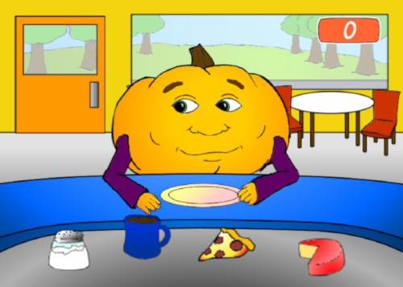

# Hungry Pumpkin

    Welcome to the repository for the revival of the classic flash game "Hungry Pumpkin"!
      
    

## Overview

This project is a labor of love, aiming to preserve life of the original game.

## About

### Inspiration
The original "Hungry Pumpkin" game, I believe it is from 2005-2007, brought joy to many. Unfortunately, it now rests in the digital archives. This project seeks to pay homage and keep the game alive.

### Authorship
While the original author remains elusive, credit is attributed to Pumpkin Productions, the alleged company behind the game. I tried to recreate every feature and sprite to faithfully capture the essence of the original.

## Getting Started

### Play in browser
1. Visit the [Itch.io Page](https://degradka.itch.io/hungry-pumpkin).
2. Click the run game button.

### Installation
1. Visit the [Releases Page](https://github.com/degradka/hungry_pumpkin/releases).
2. Download the appropriate version for your system (Windows/Linux, x64/x32).
3. Unzip the downloaded file.
4. Run the executable.

## Contribution

Contributions are welcome! Whether you're fixing a bug, enhancing features, or just have ideas to share, feel free to open an issue or submit a pull request.

## License

This project is licensed under the [GNU General Public License v3.0](LICENSE) - see the [LICENSE](LICENSE) file for details.

## Acknowledgments

Special thanks to Pumpkin Productions for the original masterpiece, forever embedded in our memory.

## TODO

- [x] Add support for Web.
- [ ] Add support for Android.
- [x] Fix mess and clean the code.
- [x] Fix Mr. Pumpkin food voicelines still queueing after animation is finished.

Feel free to pick up any tasks from the TODO list or suggest new ideas!
